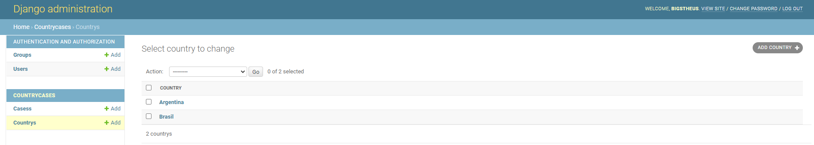

# kv-grpc-matheus-thiago
## Autores

* [Matheus Felipe Ferreira Martins](https://github.com/MatheusFFM)
* [Thiago Jorge Queiroz Silva](https://github.com/ThiagoQueirozSilva)

## Sobre o sistema

Este trabalho se trata de um monitor de covid feito com o framework web mvc django. Será exibido nesta aplicação uma tabela com diversos países demonstando
os casos de COVID-19 confirmados, os casos recuperados e as mortes causadas pela doença em cada país. Também é possível criar países e adicionar os casos para cada país
por meio do admin django.

## Execução

```bash
# Checkando se possui django
$ python -m django --version.

# Installando o django
$ python -m pip install Django.

# Clonar o repositório
$ git clone https://github.com/PUC-DISCIPLINAS/monitorcoviddjango-monitor-covid-matheus-thiago.git

# Entrar na pasta de código
$ cd covid/covidmvc
```

### Iniciando django

```bash
# Executar a aplicação
$ python manage.py runserver
```

Retorna que a aplicação foi iniciada com sucesso. Para interromper seu funcionamento pressione Ctrl + C.

## Aplicação
Após executada entre no link: http://127.0.0.1:8000/ no seu navegador.

Será exibida uma tabela com os países e seus casos de COVID-19 e um botão "Admin" onde os dados da aplicação poderão ser manipulados. Como demonstrado a seguir: 


(Valores meramente ilustrativos)

### Admin
Ao clickar no botão "Admin" será requisitado um login e uma senha.

```bash
#Usuário
admin
#Senha
hugo&ricardo
```

Feito o login será exibido duas tabelas Cases e Country como demonstrado a seguir


## Country-Admin
Ao selecionar a tabela country poderá ser adicionado um país. Será possível também editar dados de um país e também deletar um país.



Ao selecionar um case ou selecionar Add Case será possível adicionar um país no banco e selecionando um país é possível editar e editar um país como na tela a seguir.


## Cases-Admin
Ao selecionar a tabela cases poderá ser adicionado dados de casos para um país, caso ele ainda não tenha alguma. Será possível também editar os dados de casos em um país além de deletar-los.


Ao selecionar um case ou selecionar Add Case será possível adicionar dados para um país a respeito de seus dados de covid como na tela a seguir. Podendo então selecionar um país para cadastrar os seus dados de covid. Ao selecinar uma case já criado é possível editar-lo e deletar-lo como na tela a seguir.


